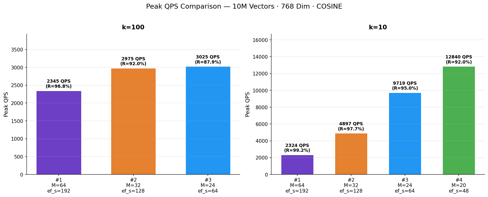
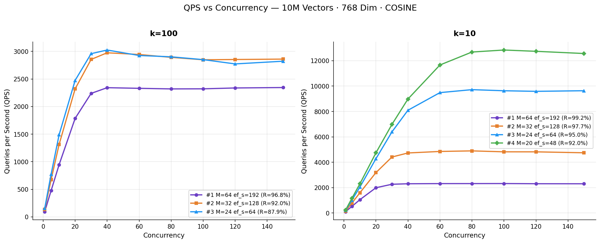
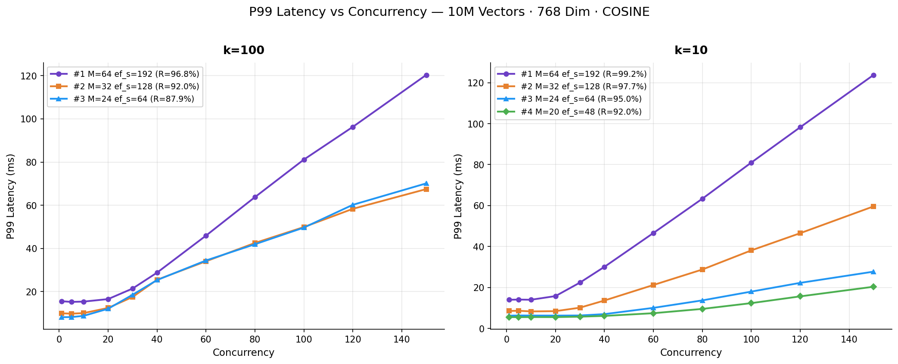
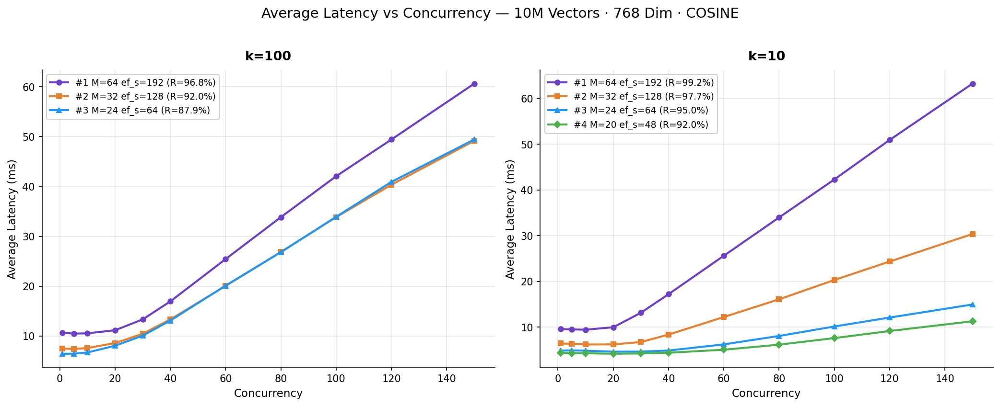
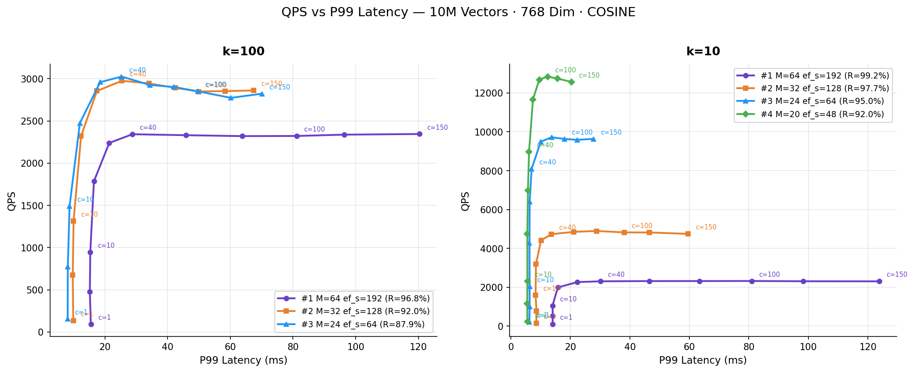
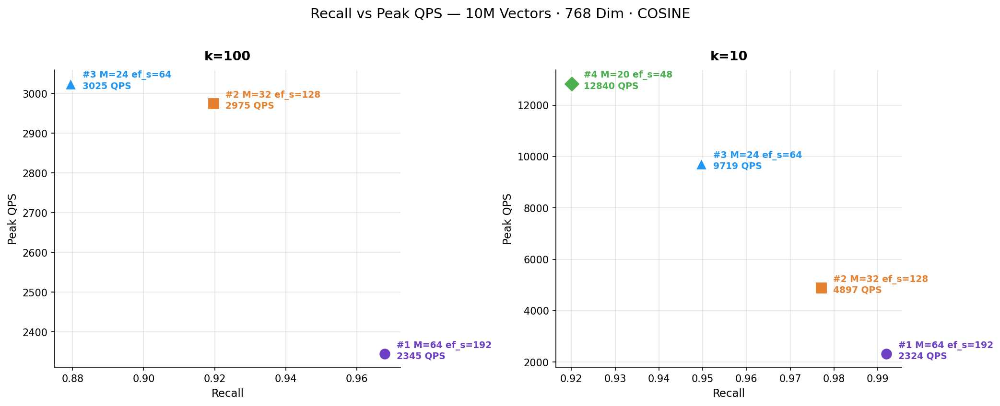

# ScyllaDB Vector Search: 10M Vectors on a Compact Cluster

In our [1-billion-vector benchmark](https://www.scylladb.com/2025/12/01/scylladb-vector-search-1b-benchmark/) we demonstrated that ScyllaDB Vector Search can sustain 252,000 QPS with 2 ms P99 latency across a large-scale deployment. But not every workload starts at a billion vectors. Many production use cases — product catalogs, knowledge bases for RAG, semantic caches — live comfortably in the 10–100 million range.

In this post we benchmark a **10-million-vector dataset** of **768-dimensional Cohere embeddings** on a compact five-node cluster: three modest storage nodes and two memory-optimized search nodes, all running on AWS Graviton. We explore four index configurations that span the recall–throughput spectrum, from near-perfect recall to maximum throughput. The results show that even this small setup can deliver **up to 12,840 QPS** at **k=10** with a **serial P99 latency of 5.5 ms** — without any quantization.

> A follow-up post covering the **100-million-vector** scale is coming soon. Stay tuned.

## Architecture at a Glance

ScyllaDB Vector Search separates storage and indexing responsibilities while keeping the system unified from the user's perspective. The ScyllaDB storage nodes hold both the structured attributes and the vector embeddings in the same distributed table.

Meanwhile, a dedicated Vector Store service — implemented in Rust and powered by the [USearch](https://github.com/unum-cloud/usearch) engine — consumes updates from ScyllaDB via CDC and builds approximate nearest neighbor (ANN) indexes in memory. Queries are issued through standard CQL:

```sql
SELECT … ORDER BY vector_column ANN OF ? LIMIT k;
```

They are internally routed to the Vector Store, which performs the HNSW similarity search and returns the candidate rows. This design allows each layer to scale independently, optimizing for its own workload characteristics and eliminating resource interference. For a detailed architectural deep-dive, see the [1B benchmark post](https://www.scylladb.com/2025/12/01/scylladb-vector-search-1b-benchmark/) and the technical blog [Building a Low-Latency Vector Search Engine for ScyllaDB](https://www.scylladb.com/2025/10/08/building-a-low-latency-vector-search-engine/).

## Benchmark Setup

### Dataset

| Property | Value |
|---|---|
| **Vectors** | 10,000,000 |
| **Dimensions** | 768 |
| **Embedding model** | Cohere |
| **Similarity function** | COSINE |
| **Quantization** | None (f32) |

### Hardware

| Role | Instance | vCPUs | RAM | Count |
|---|---|---|---|---|
| **Storage nodes** | i8g.large | 2 | 16 GB | 3 |
| **Search nodes** | r7g.2xlarge | 8 | 64 GB | 2 |

With 768-dimensional f32 vectors and `M` values up to 64, the in-memory index size can be estimated as:

> Memory ≈ N × (D × 4 + M × 16) × 1.2

For the largest configuration (M=64): 10M × (768 × 4 + 64 × 16) × 1.2 ≈ **49 GB**, which fits comfortably in the 64 GB of a single r7g.2xlarge search node. **No quantization is needed at this scale.**

### Experiments

We tested four HNSW index configurations, progressively lowering graph connectivity (`M`) and search effort (`ef_search`) to shift the balance from recall toward throughput.

| Experiment | M | ef_construction | ef_search | k tested |
|---|---|---|---|---|
| **#1** (high quality) | 64 | 384 | 192 | 100, 10 |
| **#2** (balanced) | 32 | 256 | 128 | 100, 10 |
| **#3** (high throughput) | 24 | 256 | 64 | 100, 10 |
| **#4** (max throughput) | 20 | 256 | 48 | 10 |

The three HNSW parameters control different aspects of the index:

- **`M`** (`maximum_node_connections`): Maximum edges per node in the HNSW graph. Higher values create a richer, better-connected graph that improves recall at the cost of more memory and slower inserts and queries.
- **`ef_construction`** (`construction_beam_width`): Controls how thoroughly the algorithm searches for the best neighbors when inserting a new vector. Higher values produce a higher-quality graph but slow down index building. This is a one-time cost.
- **`ef_search`** (`search_beam_width`): The main tuning knob for query performance. Controls the size of the candidate beam during search. Higher values evaluate more candidates, improving recall but increasing query latency.

Since vector index options cannot be changed after creation, each experiment required dropping and recreating the index. The CQL statements used:

```sql
-- Experiment #1: M=64, ef_construction=384, ef_search=192
CREATE CUSTOM INDEX vdb_bench_collection_vector_idx
ON vdb_bench.vdb_bench_collection (vector)
USING 'vector_index'
WITH OPTIONS = {
  'search_beam_width': '192',
  'construction_beam_width': '384',
  'maximum_node_connections': '64',
  'similarity_function': 'COSINE'
};

-- Experiment #2: M=32, ef_construction=256, ef_search=128
CREATE CUSTOM INDEX vdb_bench_collection_vector_idx
ON vdb_bench.vdb_bench_collection (vector)
USING 'vector_index'
WITH OPTIONS = {
  'search_beam_width': '128',
  'construction_beam_width': '256',
  'maximum_node_connections': '32',
  'similarity_function': 'COSINE'
};

-- Experiment #3: M=24, ef_construction=256, ef_search=64
CREATE CUSTOM INDEX vdb_bench_collection_vector_idx
ON vdb_bench.vdb_bench_collection (vector)
USING 'vector_index'
WITH OPTIONS = {
  'search_beam_width': '64',
  'construction_beam_width': '256',
  'maximum_node_connections': '24',
  'similarity_function': 'COSINE'
};

-- Experiment #4: M=20, ef_construction=256, ef_search=48
CREATE CUSTOM INDEX vdb_bench_collection_vector_idx
ON vdb_bench.vdb_bench_collection (vector)
USING 'vector_index'
WITH OPTIONS = {
  'search_beam_width': '48',
  'construction_beam_width': '256',
  'maximum_node_connections': '20',
  'similarity_function': 'COSINE'
};
```

The benchmark was run using [VectorDBBench](https://github.com/scylladb/VectorDBBench) with the upcoming ScyllaDB Python driver built on a Rust core — a dev version available at [python-rs-driver](https://github.com/scylladb-zpp-2025-python-rs-driver/python-rs-driver). VectorDBBench ramps concurrency from 1 to 150 concurrent search clients, measuring QPS, P99 and average latency at each level. A separate serial run of 1,000 queries measures recall and nDCG against brute-force ground truth.

## Results

### Peak QPS Comparison

To start our analysis, let's examine the maximum throughput each index configuration can sustain under peak concurrency. When strictly looking at the highest throughput achieved:



The bar chart highlights the dramatic impact of index parameters at k=10: throughput rises sharply as the index becomes lighter. At k=100 the differences are much smaller — all configurations cluster between 2,300 and 3,000 QPS.

### QPS vs Concurrency

The chart below shows how each index configuration scales as concurrency ramps from 1 to 150 clients.



At **k=10**, the lighter configurations (Experiments #3 and #4) scale nearly linearly up to 60–80 concurrent clients before saturating. Experiment #4 demonstrates the benefit of a leaner graph: it achieves **5.5× higher peak QPS** than Experiment #1 at k=10. At **k=100**, all configurations converge to a narrower throughput band (2,300–3,025 QPS), showing that retrieving 100 neighbors dominates the per-query cost regardless of index parameters.

### P99 and Average Latency vs Concurrency

As expected, increasing throughput adds queuing delay, leading to higher tail latencies.





Lighter configurations start at dramatically lower baseline latencies. Experiment #4 maintains sub-6 ms P99 latency up to 30 concurrent clients, while Experiment #1 starts above 13 ms even at concurrency 1. All configurations show latency rising proportionally once throughput saturates — the expected queuing behavior when the system is at capacity.

### QPS vs P99 Latency (Pareto View)

Plotting throughput directly against tail latency provides a Pareto frontier of our benchmark configurations:



This view makes the operational trade-off easier to read than the concurrency charts alone. At k=10, Experiments #3 and #4 push the frontier outward, delivering much higher QPS at the same or lower tail latency. At k=100, the frontier is tighter, which again shows that returning more neighbors dominates the total cost per query.

### Recall vs Peak QPS

Finally, plotting recall helps select the optimal index strategy based on business requirements:



This chart summarizes the core choice in a single picture: whether to spend compute on accuracy or throughput. Experiment #1 sits at the high-recall end, Experiment #4 at the high-throughput end, and Experiment #2 emerges as the practical middle ground for workloads that need both.

## Scenario Analysis

With the charts above as a visual reference, let's examine the three main usage scenarios that emerge from the data.

### Scenario 1: Maximum Throughput

Experiments #3 (M=24, ef_search=64) and #4 (M=20, ef_search=48) target workloads where throughput is the primary objective and moderate recall is acceptable — for example, coarse candidate retrieval stages in recommendation pipelines or semantic deduplication.

At **k=10**, Experiment #4 reached a peak of **12,840 QPS** at concurrency 100, with a serial P99 latency of just **5.5 ms** and recall of **92.0%**. Experiment #3 achieved **9,719 QPS** with marginally better recall at **95.0%** and a serial P99 of **6.0 ms**.

Even at **k=100**, these lightweight configurations delivered competitive throughput: Experiment #3 peaked at **3,025 QPS** (87.9% recall) — comparable to the heavier configurations. Retrieval of 100 neighbors per query inherently requires more work, which limits the throughput range across all configurations.

### Scenario 2: High Recall

Experiment #1 (M=64, ef_search=192) prioritizes accuracy for applications that cannot tolerate missed results — high-fidelity semantic search, retrieval-augmented generation (RAG) pipelines, or compliance-sensitive retrieval.

At **k=10**, the system delivered **99.2% recall** and **99.1% nDCG** — essentially indistinguishable from exact brute-force search. Peak QPS reached **2,324** with a serial P99 latency of **14.6 ms**. At **k=100**, recall was **96.8%** with **2,345 QPS** and a serial P99 of **15.2 ms**.

The higher latency and lower throughput are a direct consequence of the richer graph (64 connections per node) and wider search beam (192 candidates), which evaluate substantially more distance computations per query.

### Scenario 3: Balanced

Experiment #2 (M=32, ef_search=128) occupies the middle ground, offering strong recall with significantly better throughput than the high-recall configuration.

At **k=10**, it achieved **97.7% recall** with **4,897 QPS** — roughly double the throughput of Experiment #1, with only a 1.5 percentage-point recall reduction. The serial P99 was **8.7 ms**. At **k=100**, recall was **92.0%** with **2,975 QPS** and a serial P99 of **9.6 ms**.

This configuration represents a practical sweet spot for many production deployments where both recall and throughput matter.

## Summary Tables

### k=100

| Metric | #1 M=64 ef_s=192 | #2 M=32 ef_s=128 | #3 M=24 ef_s=64 |
|---|---|---|---|
| **Peak QPS** | 2,345 (c=150) | 2,975 (c=40) | 3,025 (c=40) |
| **QPS @ c=10** | 947 | 1,314 | 1,489 |
| **Serial P99 Latency** | 15.2 ms | 9.6 ms | 7.8 ms |
| **P99 Latency @ c=1** | 15.5 ms | 9.9 ms | 8.1 ms |
| **P99 Latency @ c=100** | 81.2 ms | 49.9 ms | 49.6 ms |
| **Recall** | 96.8% | 92.0% | 87.9% |
| **nDCG** | 97.3% | 93.1% | 89.7% |

### k=10

| Metric | #1 M=64 ef_s=192 | #2 M=32 ef_s=128 | #3 M=24 ef_s=64 | #4 M=20 ef_s=48 |
|---|---|---|---|---|
| **Peak QPS** | 2,324 (c=100) | 4,897 (c=80) | 9,719 (c=80) | 12,840 (c=100) |
| **QPS @ c=10** | 1,054 | 1,602 | 2,046 | 2,311 |
| **Serial P99 Latency** | 14.6 ms | 8.7 ms | 6.0 ms | 5.5 ms |
| **P99 Latency @ c=1** | 14.0 ms | 8.5 ms | 6.2 ms | 5.5 ms |
| **P99 Latency @ c=100** | 81.0 ms | 38.1 ms | 18.0 ms | 12.3 ms |
| **Recall** | 99.2% | 97.7% | 95.0% | 92.0% |
| **nDCG** | 99.1% | 97.6% | 94.9% | 92.0% |

### Key Takeaways

- **k=10 vs k=100:** At k=10, lighter index parameters yield massive throughput gains (up to 5.5×) with modest recall loss. At k=100, all configurations converge to a narrow QPS band (~1.3× range) because retrieving more neighbors dominates per-query cost.
- **Recall trade-offs are favorable:** At k=10, recall drops only 7.2 pp (99.2% → 92.0%) for a 5.5× QPS increase. At k=100 the trade-off is steeper: 8.9 pp for just 1.3× gain.
- **Latency tracks index weight:** Serial P99 drops from 14.6 ms to 5.5 ms at k=10, and from 15.2 ms to 7.8 ms at k=100, as lighter graphs require fewer distance computations.
- **Saturation points differ:** Experiments #1–#3 plateau around c=40–80; Experiment #4 scales further to c=100 before saturating, reflecting its lower per-query compute cost.

## Conclusion

These results show that ScyllaDB Vector Search delivers strong performance even on a compact, five-node cluster with 10 million 768-dimensional vectors. A pair of r7g.2xlarge search nodes provides enough memory to hold the full HNSW index at f32 precision — no quantization needed. The three storage nodes with replication factor 3, combined with vector search nodes distributed across availability zones, also provide **high availability** — the system is designed to tolerate node failures without data loss or service interruption. Depending on the index configuration, the system can prioritize near-perfect recall (99.2% at k=10) or maximize throughput (12,840 QPS at k=10 with 92% recall), with practical balanced options in between.

This 10M scenario represents the accessible end of the scale. For workloads that push into hundreds of millions or billions of vectors, quantization, additional search nodes, and larger instances extend the same architecture seamlessly. See our [1-billion-vector benchmark](https://www.scylladb.com/2025/12/01/scylladb-vector-search-1b-benchmark/) for results at extreme scale, and look for our upcoming **100-million-vector benchmark** post.

The full Jupyter notebook with interactive charts and all data is available [in the repository](../benchmark_results.ipynb).

Ready to try it yourself? Follow the [ScyllaDB Vector Search Quick Start Guide](https://cloud.docs.scylladb.com/stable/vector-search/vector-search-quick-start.html) to get started.
